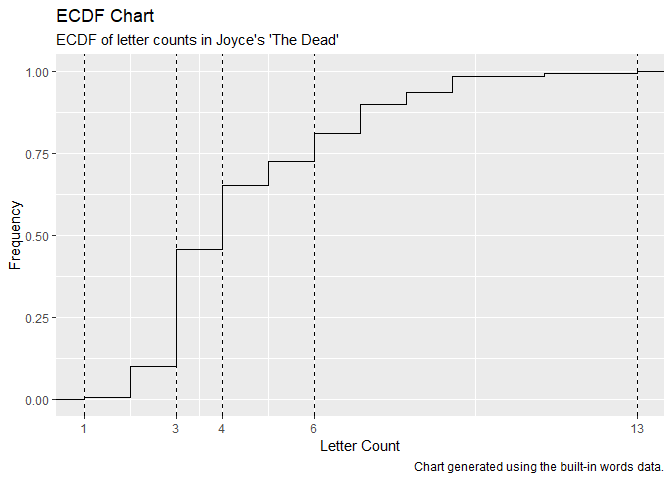

<!-- README.md is generated from README.Rmd. Please edit that file -->

# fdistr

<!-- badges: start -->

[](https://travis-ci.org/dtminnick/fdistr)
[](https://CRAN.R-project.org/package=fdistr)
[](https://codecov.io/gh/dtminnick/fdistr?branch=master)
<!-- badges: end -->

The fdistr package provides an efficient way to create frequency
distribution tables and use those tables to generate Pareto charts.

Frequency distribution tables show the frequency of various outcomes in
a data set. Each entry in the table contains a frequency or count of
values within a particular group or interval, and in this way, the table
summarizes the distribution of values in the data set.

A Pareto chart visually depicts the frequency distribution table.

## Installation

You can install the released version of fdistr from
[CRAN](https://CRAN.R-project.org) with:

``` r
install.packages("fdistr")
```

And the development version from [GitHub](https://github.com/) with:

``` r
# install.packages("devtools")
devtools::install_github("dtminnick/fdistr")
```

## Example

This basic example which shows you how to use the fdistr package with
the built-in `words` dataset.

Start by loading the `words` dataset. The dataset contains a data frame
with six variables about a collection of words taken from the first
paragraph of James Joyce’s short story “The Dead.”

``` r
library(fdistr)

data(words)

str(words)
#> 'data.frame':    127 obs. of  6 variables:
#>  $ word        : chr  "lily" "the" "caretaker's" "daughter" ...
#>  $ first_letter: chr  "l" "t" "c" "d" ...
#>  $ last_letter : chr  "y" "e" "s" "r" ...
#>  $ letter_count: int  4 3 11 8 3 9 3 3 3 4 ...
#>  $ starts_with : chr  "consonant" "consonant" "consonant" "consonant" ...
#>  $ ends_with   : chr  "consonant" "vowel" "consonant" "consonant" ...
```

It is possible to create a frequency distribution table with any of the
six variables in this table. For this example, pass the `first_letter`
variable to the `create_table` function and return the table (stored as
a data frame) to a variable called `table`. Use the `dec_pos` argument
to set the number of positions following the decimal to be displayed in
the table.

``` r
table <- create_table(words$first_letter, dec_pos = 3)

table
#>    group count frequency cumulative_count cumulative_frequency
#> 1      t    22     0.173               22                0.173
#> 2      a    16     0.126               38                0.299
#> 3      h    16     0.126               54                0.425
#> 4      o    10     0.079               64                0.504
#> 5      l     8     0.063               72                0.567
#> 6      w     8     0.063               80                0.630
#> 7      b     7     0.055               87                0.685
#> 8      c     5     0.039               92                0.724
#> 9      s     5     0.039               97                0.764
#> 10     d     4     0.031              101                0.795
#> 11     f     4     0.031              105                0.827
#> 12     g     4     0.031              109                0.858
#> 13     i     4     0.031              113                0.890
#> 14     m     4     0.031              117                0.921
#> 15     j     2     0.016              119                0.937
#> 16     k     2     0.016              121                0.953
#> 17     p     2     0.016              123                0.969
#> 18     e     1     0.008              124                0.976
#> 19     n     1     0.008              125                0.984
#> 20     r     1     0.008              126                0.992
#> 21     u     1     0.008              127                1.000
```

In this example, the frequency distribution table provides a row for
each unique first letter in the dataset, arranged in descending order of
count, with the frequency, cumulative count and cumulative frequency for
each first letter.

To plot the data in a Pareto chart, pass the `table` data frame to the
`create_pareto` function along with character strings for the plot
labels.

``` r
create_pareto(table,
              title = "Pareto Chart",
              subtitle = "Frequency of first letters in Joyce's 'The Dead'",
              x_label = "Letter",
              y_label = "Frequency",
              caption = "Chart generated using the built-in words data.")
```


Bars in the chart show the frequency of each first letter and a line
shows the cumulative frequency with points to highlight the cumulative
frequency for each value above the bars. The Pareto chart is an
effective way to show the frequencies of values.

When working with a continuous variable, such as ’letter\_count`in
the`words`dataset, the`create\_ecdf\` function creates an empirical
cumulative distribution function, or ECDF, plot. The ECDF plot shows the
proportion of observations that are less than or equal to each obverved
value.

``` r
create_ecdf(words$letter_count,
            title = "ECDF Chart",
            subtitle = "ECDF of letter counts in Joyce's 'The Dead'",
            x_label = "Letter Count",
            y_label = "Frequency",
            caption = "Chart generated using the built-in words data.")
```



The height of each step in the plot is the frequency of each value in
the observed data and the length of each horizontal line shows the
distance between values. Dashed vertical lines plot the quartiles along
with their values on the x-axis.
