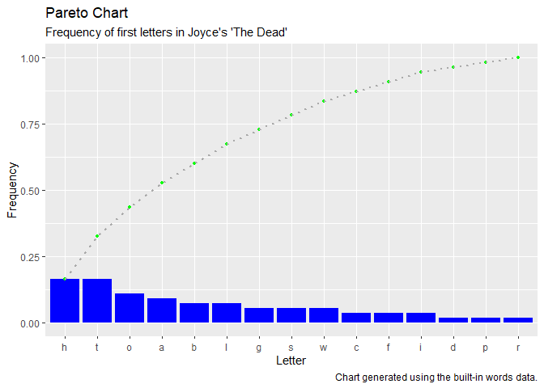

<!-- README.md is generated from README.Rmd. Please edit that file -->

# fdistr

<!-- badges: start -->

[](https://travis-ci.org/dtminnick/fdistr)
[](https://CRAN.R-project.org/package=fdistr)
[](https://codecov.io/gh/dtminnick/fdistr?branch=master)
<!-- badges: end -->

The goal of fdistr is to provide an efficient way to create frequency
distribution tables and use those tables to generate Pareto charts.

Frequency distribution tables are used to show the frequency of various
outcomes in a data set. Each entry in the table contains a frequency or
count of the occurrences of values within a particular group or
interval, and in this way, the table summarizes the distribution of
values in the data set.

A Pareto chart is a bar graph visually depicts the frequency
distribution table.

## Installation

You can install the released version of fdistr from
[CRAN](https://CRAN.R-project.org) with:

``` r
install.packages("fdistr")
```

And the development version from [GitHub](https://github.com/) with:

``` r
# install.packages("devtools")
devtools::install_github("dtminnick/fdistr")
```

## Example

What follows is a basic example which shows you how to use the fdistr
package with the built-in `words` dataset.

Start by loading the `words` dataset. The dataset contains a data frame
with four variables about a collection of words taken from the first
paragraph of James Joyce’s short story “The Dead.”

``` r
library(fdistr)

data(words)

str(words)
#> 'data.frame':    55 obs. of  4 variables:
#>  $ word        : chr  "lily" "the" "caretaker’s" "daughter" ...
#>  $ first_letter: chr  "l" "t" "c" "d" ...
#>  $ last_letter : chr  "y" "e" "s" "r" ...
#>  $ letter_count: int  4 3 11 8 3 9 3 3 3 4 ...
```

It is possible to create a frequency distribution table with any of the
four variables in this table. For this example, pass the `first_letter`
variable to the `create_table` function and return the table (stored as
a data frame) to a variable called `table`. Use the `dec_pos` argument
to set the number of positions following the decimal to be displayed in
the table.

``` r
table <- create_table(words$first_letter,
                      dec_pos = 3)

table
#>    group count frequency cumulative_count cumulative_frequency
#> 1      h     9     0.164                9                0.164
#> 2      t     9     0.164               18                0.327
#> 3      o     6     0.109               24                0.436
#> 4      a     5     0.091               29                0.527
#> 5      b     4     0.073               33                0.600
#> 6      l     4     0.073               37                0.673
#> 7      g     3     0.055               40                0.727
#> 8      s     3     0.055               43                0.782
#> 9      w     3     0.055               46                0.836
#> 10     c     2     0.036               48                0.873
#> 11     f     2     0.036               50                0.909
#> 12     i     2     0.036               52                0.945
#> 13     d     1     0.018               53                0.964
#> 14     p     1     0.018               54                0.982
#> 15     r     1     0.018               55                1.000
```

In this case, the frequency distribution table provides a row for each
unique first letter in the dataset, arranged in descending order of
count, with the frequency, cumulative count and cumulative frequency for
each first letter.

To plot the data in a Pareto chart, pass the `table` data frame to the
`create_pareto` function along with character strings for the plot
labels.

``` r
create_pareto(table,
              title = "Pareto Chart",
              subtitle = "Frequency of first letters in Joyce's 'The Dead'",
              x_label = "Letter",
              y_label = "Frequency",
              caption = "Chart generated using the built-in words data.")
```


